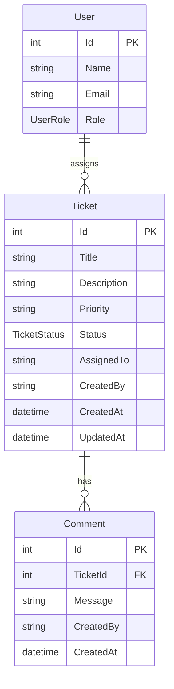

# Data Model

## Entity Relationship

## User

| Field | Type | Required | Notes |
|-------|------|----------|-------|
| Id | int | auto | SQL Server identity |
| Name | string | yes | Display name |
| Email | string | yes | Contact email |
| Role | enum | yes | Analyst, Agent, Admin |

Seeded via `AppDbContext` (no user-management UI). `GET /api/users` supplies assignee options in the UI.

## Ticket

| Field | Type | Required | Notes |
|-------|------|----------|-------|
| Id | int | auto | SQL Server identity |
| Title | string (max 120) | yes | Trimmed on create/update |
| Description | string (max 2000) | yes | Trimmed on create/update |
| Priority | string | yes | Default: `Medium`; values: Low, Medium, High |
| Status | enum | yes | Default: `Open` |
| AssignedTo | string | no | Optional assignee name |
| CreatedBy | string | yes | Default: `Analyst` on create |
| CreatedAt | datetime (UTC) | auto | Set at creation |
| UpdatedAt | datetime (UTC) | auto | Updated on every change |

## Comment

| Field | Type | Required | Notes |
|-------|------|----------|-------|
| Id | int | auto | SQL Server identity |
| TicketId | int | yes | FK to Ticket; cascade delete |
| Message | string (max 2000) | yes | Trimmed on create |
| CreatedBy | string | yes | Author display name |
| CreatedAt | datetime (UTC) | auto | Set at creation |

## TicketStatus Enum

| Value | Meaning |
|-------|---------|
| Open | Newly created, awaiting triage |
| InProgress | Actively being worked |
| Resolved | Fix delivered, pending closure |
| Closed | Completed and archived |
| Cancelled | Withdrawn without resolution |

## State Machine

Valid transitions enforced in `TicketService.IsValidTransition`:

| From | To |
|------|-----|
| Open | InProgress, Cancelled |
| InProgress | Resolved, Cancelled |
| Resolved | Closed |

All other transitions return `400 Bad Request` with an error message.

## Seed Data

`AppDbContext` seeds two sample tickets and one comment for local demos. See `database/README.md` for migration details.

## Persistence

- Provider: SQL Server via EF Core
- Tables: `Tickets`, `Comments`
- Migration: `20260719035711_InitialCreate`
- Index: `IX_Comments_TicketId` on `Comments.TicketId`
