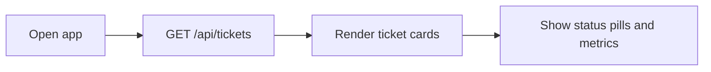
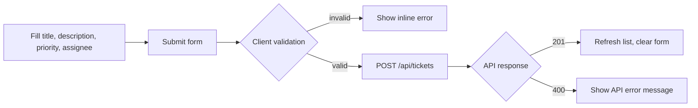
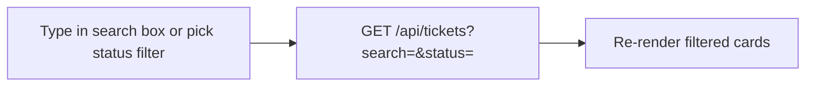
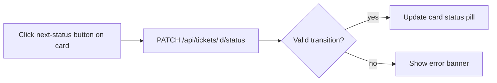
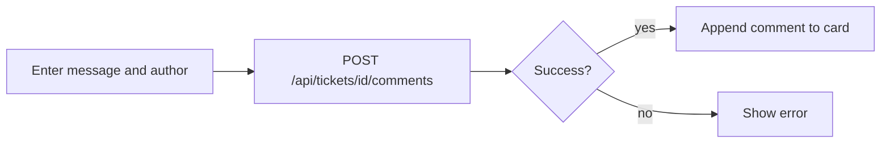

# UI Flow

## Screen Layout

The React dashboard (`frontend/src/App.jsx`) is a single-page workspace with three regions:

1. **Header** — app title and live ticket count
2. **Sidebar** — create-ticket form and search/filter controls
3. **Main panel** — ticket cards with status actions and comments

## User Flows

### 1. View dashboard on load

On mount, the UI fetches all tickets from `http://localhost:5195/api/tickets` and displays them as cards sorted by creation date (newest first, server-side).

### 2. Create a ticket

Required fields: title, description, priority. Assignee is optional.

### 3. Search and filter

Search matches title or description (case-sensitive substring on server). Status filter accepts enum names (`Open`, `InProgress`, etc.).

### 4. Advance ticket status

The UI only shows buttons for valid next states:

| Current status | Available actions |
|----------------|-------------------|
| Open | Start (→ InProgress), Cancel |
| InProgress | Resolve (→ Resolved), Cancel |
| Resolved | Close (→ Closed) |
| Closed / Cancelled | No actions |

### 5. Add a comment

## Error Handling (UI)

| Scenario | UI behavior |
|----------|-------------|
| API unreachable | Banner: "Could not reach the API. Is the backend running?" |
| 400 validation error | Inline message from API response body |
| Invalid status transition | Error banner with transition message |
| Empty required fields | Client-side block before API call |

## Component Map

| Component | Responsibility |
|-----------|----------------|
| `App.jsx` | Layout, data fetching, global error state |
| `TicketForm.jsx` | Create-ticket form with validation |
| `TicketFilters.jsx` | Search input and status dropdown |
| `TicketCard.jsx` | Single ticket display, status buttons, comments |
| `api/tickets.js` | Fetch wrappers for all API endpoints |
